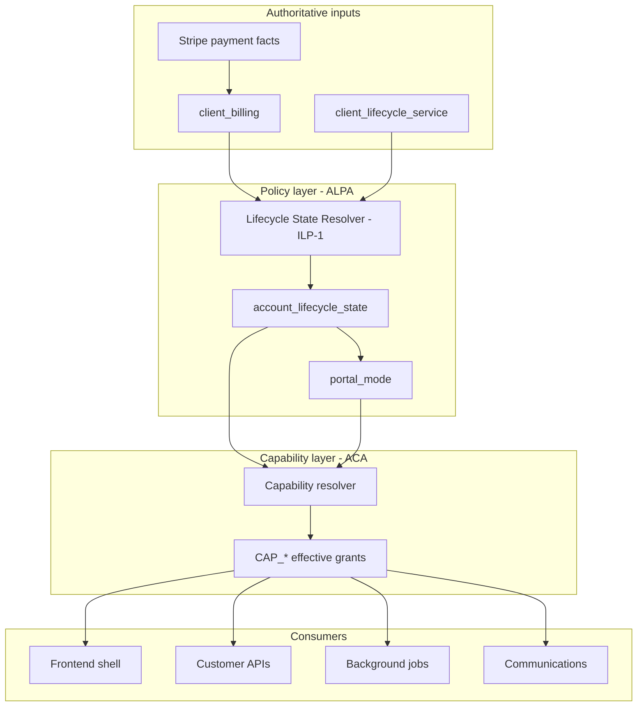
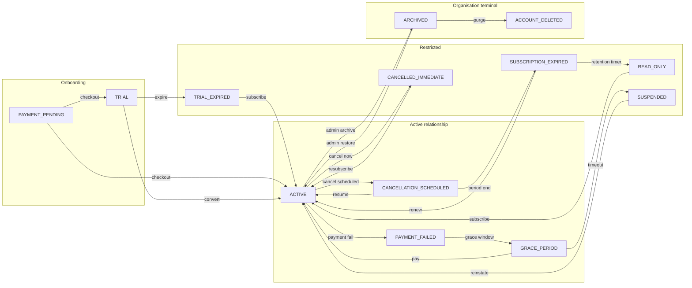
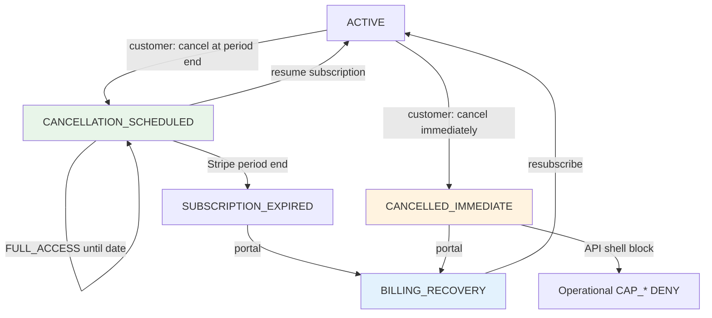
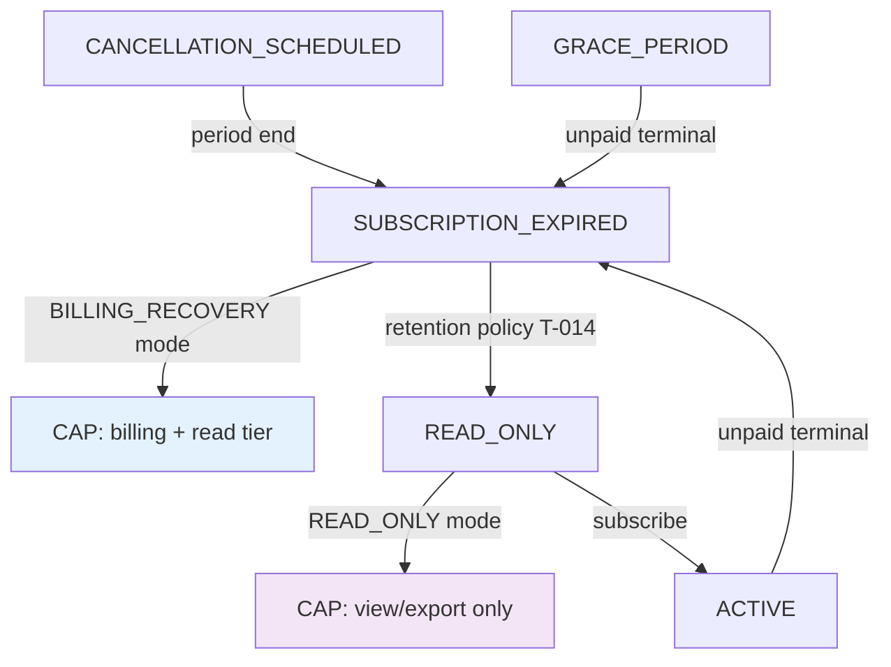
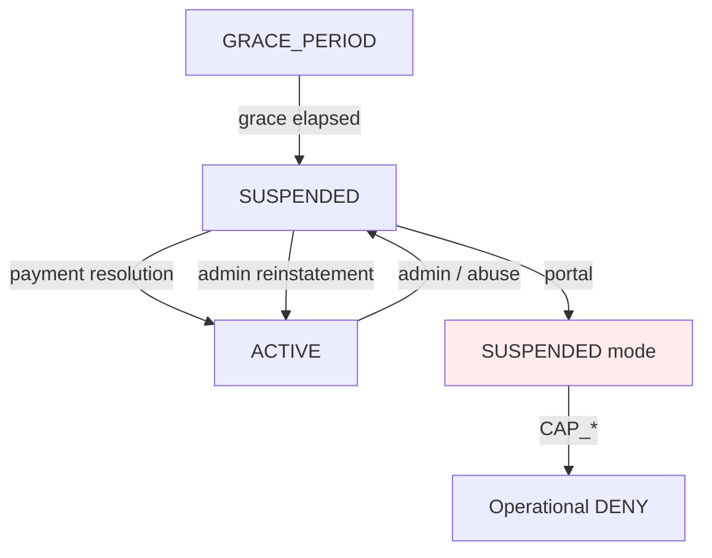
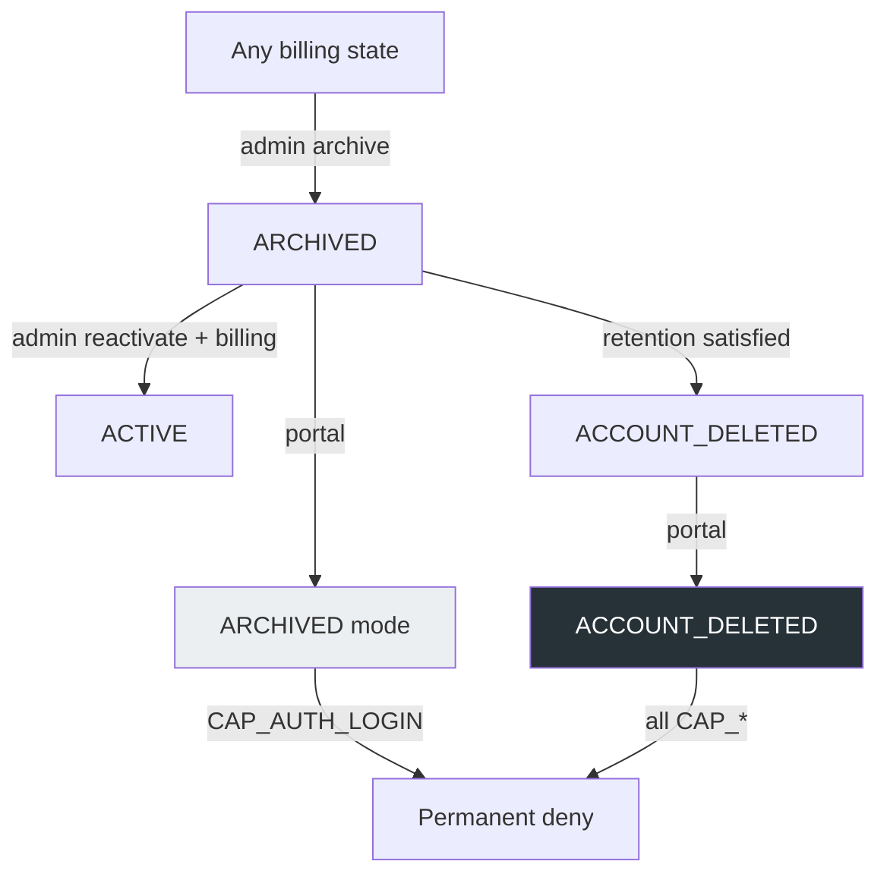
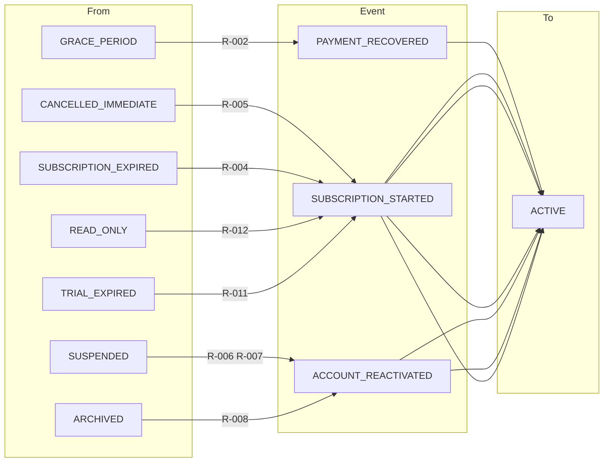
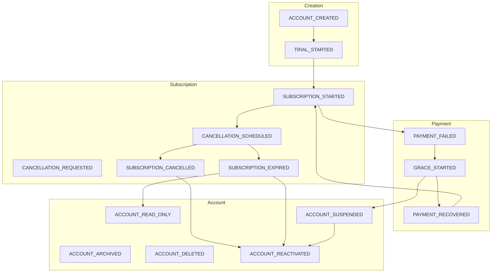
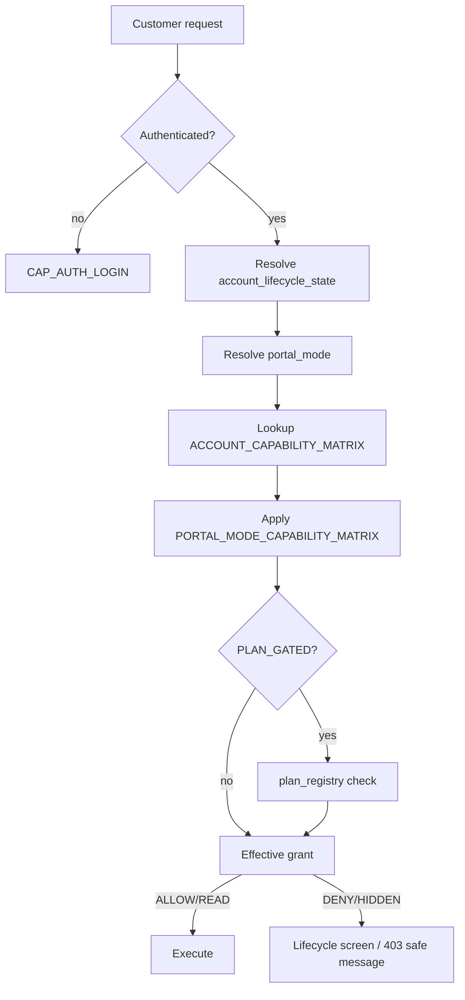

# Account Lifecycle State Diagram

**Programme:** ACCOUNT-LIFECYCLE-CAPABILITY-AUTHORITY-01  
**Parent:** `ACCOUNT_LIFECYCLE_POLICY_AUTHORITY.md`, `ACCOUNT_CAPABILITY_AUTHORITY.md`  
**Purpose:** Human-readable governance diagram for lifecycle architecture

---

## Authority stack

---

## Lifecycle states and portal modes

### Portal mode overlay

| State group | Portal mode |
|-------------|-------------|
| ACTIVE, TRIAL, CANCELLATION_SCHEDULED, PAYMENT_FAILED | `FULL_ACCESS` |
| GRACE_PERIOD | `GRACE` |
| TRIAL_EXPIRED, PAYMENT_PENDING | `PAYMENT_REQUIRED` |
| CANCELLED_IMMEDIATE, SUBSCRIPTION_EXPIRED, UNKNOWN | `BILLING_RECOVERY` |
| READ_ONLY, LEGACY | `READ_ONLY` |
| SUSPENDED | `SUSPENDED` |
| ARCHIVED | `ARCHIVED` |
| ACCOUNT_DELETED | `ACCOUNT_DELETED` |

---

## Cancellation flows

**Distinct concepts:** Cancellation scheduled ≠ immediate ≠ expiry. Each maps to different capability grants.

---

## Expiry and read-only flows

---

## Suspension flows

---

## Archiving and deletion flows

---

## Reactivation paths (summary)

**Restoration:** Reactivation restores capability grants per `ACCOUNT_REACTIVATION_AUTHORITY.md` scope (Everything / Read-only / Selective).

---

## Lifecycle events (canonical)

---

## Capability resolution (per request)

---

## Terminal states reference

| State | Terminal? | Recovery | Capability default |
|-------|-----------|----------|-------------------|
| TRIAL_EXPIRED | Billing terminal | Subscribe | PAYMENT_REQUIRED subset |
| CANCELLED_IMMEDIATE | Billing terminal | Resubscribe | BILLING_RECOVERY |
| SUBSCRIPTION_EXPIRED | Billing terminal | Renew | BILLING_RECOVERY |
| READ_ONLY | Soft terminal | Subscribe | READ grants |
| SUSPENDED | Access terminal | Payment/admin | DENY operational |
| ARCHIVED | Org terminal | Admin only | DENY all customer |
| ACCOUNT_DELETED | Hard terminal | None | DENY all |

---

**Outcome:** `ACCOUNT_LIFECYCLE_STATE_DIAGRAM_COMPLETE`
