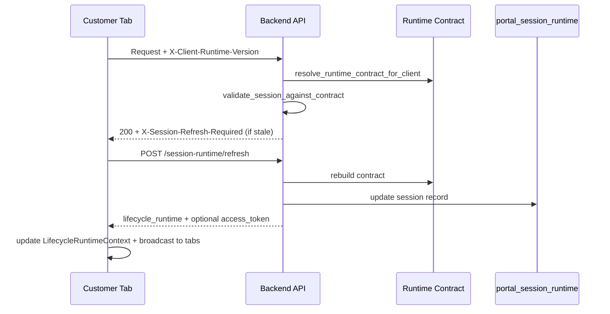

# Account Runtime Refresh Architecture (ILP-5)

## Refresh triggers

### Backend

- Login, password-set auto-login, session extend → new session record + version hints in JWT
- `POST /client/session-runtime/refresh` → full contract + session update
- Every `/api/client/*` request → validation via `client_route_guard` (cached contract)

### Frontend

| Trigger | Handler |
|---------|---------|
| Login / user change | `fetchRuntime({ force: true })` |
| Polling (`polling_policy.enabled`) | 120s interval |
| Tab visible | `visibilitychange` (15s throttle) |
| Window focus | `focus` (10s throttle) |
| API response header | `X-Session-Refresh-Required` → `refreshSession` |
| Session extend | `SessionIdleGuard` → `refreshSession('session_extend')` |
| Manual | `useLifecycleRuntime().refreshSession()` |
| Multi-tab | `BroadcastChannel` / `storage` invalidation |
| Offline recovery | `online` event + 30s retry while offline |

## Refresh flow

## Storm prevention

- `refreshLockRef` — single in-flight refresh
- `REFRESH_THROTTLE_MS` — 5s minimum between attempts
- Skip refresh on `/session-runtime/refresh` response interceptor loop
- Tab sync ignores events older than `lastFetchRef`

## Failure handling

| Condition | Behaviour |
|-----------|-------------|
| Runtime fetch fails | Governed fallback UI; capabilities deny (safe) |
| Refresh fails | Fallback to `fetchRuntime` |
| `SESSION_FORCE_REAUTH` | Logout + login redirect |
| Offline | Degraded message; retry when online |

## Capability cache invalidation

On successful refresh:

- `runtime` state replaced → all `useCapability` / domain hooks recompute
- Protected routes re-evaluate grants
- Navigation capabilities refresh via `usePortalNavigationCapabilities`
- Portal mode presentation updates via `usePortalMode`
