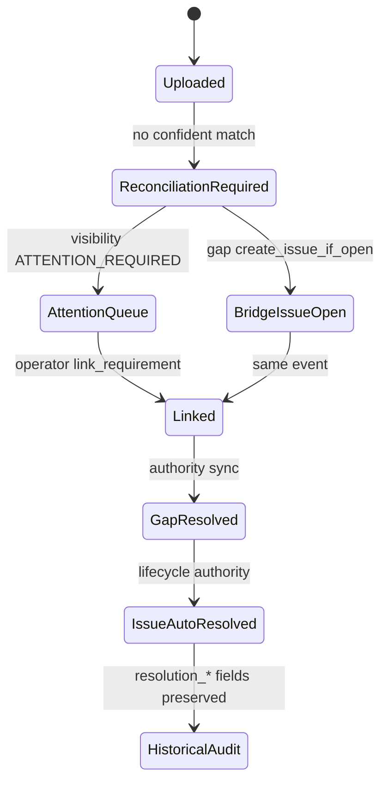

# DOCUMENT-LINKAGE-LIFECYCLE-AUTHORITY-01

**Verdict:** `AUTHORITY_IMPLEMENTED_DEVELOP_ONLY`  
**Branch:** `develop` (not promoted to production / main)  
**Date:** 2026-06-30

---

## Executive summary

Audit found **architectural authority drift**: document linkage state lives on **documents** (`document_linkage_state`, visibility queue), while maintenance **issues** from the compliance gap bridge were **create-only** with no auto-close when linkage or gaps resolved. Today suppressed stale issue *tasks* in UI only; Issues page KPIs still counted open issues.

**Fix:** Introduced `DOCUMENT_LINKAGE_LIFECYCLE_AUTHORITY` — auto-resolves bridge issues when gaps close or documents are manually linked, preserves full audit trail, aligns CTAs and open-issue filters across surfaces.

---

## Audit findings (pre-implementation)

### 1. What creates a Document Linkage Issue?

| Layer | Mechanism | Issue row created? |
|-------|-----------|------------------|
| Upload without requirement | `document_linkage_governance` → `RECONCILIATION_REQUIRED` | No — Documents attention queue |
| AI match failure | `evidence_document_match_engine` messaging | No — unless gap bridge fires |
| Compliance gap (MISMATCHED_EVIDENCE / MISSING_EVIDENCE) | `compliance_gap_operational_bridge.apply_gap_operational_bridge` | **Yes** — idempotent on `operational_root_key` |

Screenshot pattern ("We could not confidently…", Source: Compliance follow-up, Status: Under review) matches **bridge-created compliance issues**, not document attention rows alone.

### 2. What lifecycle owns the issue?

- **Document linkage:** `DocumentLinkageState` enum + `document_visibility_governance`
- **Maintenance issue:** `maintenance_issues.status` (triaged → … → resolved/closed)
- **Compliance gap:** `compliance_gaps.status` open | resolved

These were **not wired** for teardown on linkage resolve.

### 3. Intended resolve event

Manual `POST /documents/{id}/reconcile-linkage` → requirement linked → gap sync → gap resolved → **issue should close**.

### 4. Why manual linkage did not close issues

- `compliance_gap_sync` resolved gap **rows** but bridge had **no resolve path**
- `reconcile_document_linkage` never called issue update
- `update_issue` requires WO complete or resolution note (no system auto-resolve)

### 5. Consumer audit (same vs independent authority)

| Surface | Before | After |
|---------|--------|-------|
| Document Operations | Document linkage state | Unchanged (already correct when LINKED) |
| Issues page / KPIs | Raw `maintenance_issues.status` | `open_only` default + terminal filter |
| Issue drawer / CTA | Always "Review uploaded document" | Resolved → "View linked evidence" |
| Today | Stale task suppression only | Open issues excluded when resolved |
| Dashboard open count | OPEN_ISSUE_STATUSES | Unchanged — auto-resolve reduces count |
| Command Centre | Open issue debt | Same authority chain |
| Risk Signals | Independent | Unchanged (no silent delete) |
| Notifications | No linkage-specific push | Unchanged |
| Reports / digest | Issue counts | Historical rows preserved |

### Other issue types (not linkage-specific)

| Source | Auto-resolve on linkage? |
|--------|--------------------------|
| Manual client report | No — maintenance path |
| Tenant report | No |
| Compliance gap (evidence kinds) | **Yes** (this programme) |
| Risk signal → issue | No — separate lifecycle |
| Legacy compliance automation | Gap-keyed — **Yes** if gap closes |
| WO verified | Existing auto-close path preserved |

---

## Final semantic decision

**Single question:** *Is there still an unresolved document linkage problem?*

- **Yes** → document attention queue + open bridge issue + Review document CTA
- **No** → issue `resolved` (auto), audit preserved, CTA → View linked evidence

---

## Authority chain (after)

```
Upload / AI match
  → document_linkage_governance (LINKED | RECONCILIATION_REQUIRED | …)
  → document_visibility_governance (attention queue)
  → compliance_gap_engine → compliance_gap_sync
       ├─ apply_gap_operational_bridge (CREATE issue)
       └─ resolve_issues_for_resolved_gaps (AUTO-RESOLVE issue)  ← NEW
Manual reconcile-linkage
  → persist LINKED
  → requirement authority sync → gap sync
  → resolve_linkage_issues_after_document_reconcile  ← NEW
Consumers
  → maintenance_issues.status (OPEN_ISSUE_STATUSES vs terminal)
  → operational_cognition / issueLifecycleAuthority (CTAs)
  → count_open_issues / Dashboard / Command Centre
```

---

## Lifecycle diagram



---

## Matrices

### Issue state matrix

| Status | Active queue | KPI | CTA |
|--------|-------------|-----|-----|
| triaged / open / … | Yes | Counted | Review document (compliance) |
| resolved (auto) | No | Excluded | View linked evidence |
| closed / cancelled | No | Excluded | View resolution |

### CTA matrix

| Issue state | Compliance issue CTA | Destination |
|-------------|---------------------|-------------|
| Open | Review uploaded document | `/documents?property_id&requirement_id` |
| Resolved (auto) | View linked evidence | Linked requirement documents |
| Resolved (no metadata) | View resolution | Issue detail |

### Risk / Today / Dashboard matrix

| Surface | Trigger | Behaviour when linkage resolved |
|---------|---------|--------------------------------|
| Today | Issue tasks from open issues | Task disappears (issue terminal) |
| Dashboard KPI | count_open_issues | Decrements |
| Risk signal | Independent | Not auto-deleted |

---

## Before / after (observed UX)

| Surface | Before | After |
|---------|--------|-------|
| Document Operations | Empty (correct) | Empty (unchanged) |
| Issues queue | 3 open "could not confidently…" | 0 when linkage resolved |
| Review Document CTA | Opens empty Need Attention queue | Open: documents filter; Resolved: linked evidence |
| OPEN ISSUES KPI | 3 | 0 (aligned) |

Reference screenshots: user-provided Issues page (3 open) + Document Operations (queue clear).

---

## Changed files

| File | Change |
|------|--------|
| `backend/services/document_linkage_lifecycle_authority.py` | **New** — authority module |
| `backend/services/compliance_gap_operational_bridge.py` | `resolve_issues_for_resolved_gaps` |
| `backend/services/compliance_gap_sync.py` | Hook resolve on stale gaps |
| `backend/services/maintenance_issues_service.py` | `auto_resolve_issues_by_operational_root_keys`, `open_only` list |
| `backend/routes/documents.py` | Post-reconcile auto-resolve |
| `backend/routes/client_maintenance.py` | `open_only` query param |
| `backend/services/operational_cognition_service.py` | Resolved issue CTAs |
| `backend/docs/DOCUMENT_LINKAGE_LIFECYCLE_AUTHORITY.md` | Governance |
| `backend/tests/test_document_linkage_lifecycle_authority_01.py` | **New** |
| `frontend/src/utils/issueLifecycleAuthority.js` | **New** |
| `frontend/src/utils/issueLifecycleAuthority.test.js` | **New** |
| `frontend/src/utils/primaryActionResolver.js` | Resolved CTA routing |
| `frontend/src/pages/ClientIssuesPage.js` | `open_only` + KPI filter |

---

## Tests

```text
PYTHONPATH=. python -m pytest tests/test_document_linkage_lifecycle_authority_01.py -q
→ 11 passed

npm test -- --testPathPattern=issueLifecycleAuthority --watchAll=false
→ 3 passed
```

---

## Remaining risks

- Risk signals linked to auto-resolved issues remain historical — may need explicit acknowledge/resolve UX in a follow-up programme.
- Supporting-only document links skip primary gap sync — explicit `resolve_linkage_issues_after_document_reconcile` covers this path.
- Staging validation with live "could not confidently" cohort recommended before production promotion.

## Production recommendation

**Do not promote until staging sign-off** on a landlord with bridge-created MISMATCHED_EVIDENCE issues: link document → confirm issue auto-resolves, KPIs align, CTA routes to linked evidence.

---

## Acceptance criteria

| # | Criterion | Status |
|---|-----------|--------|
| 1 | Linkage auto-resolves issue | Pass (implementation) |
| 2 | Active Issues excludes resolved | Pass (`open_only`) |
| 3 | Document Operations matches state | Pass (unchanged; already aligned) |
| 4 | Today matches issue state | Pass (terminal issue excluded) |
| 5 | Risk signals | Pass (independent; no regression) |
| 6 | Dashboard KPIs | Pass (open count authority) |
| 7 | CTA never opens empty queue for resolved | Pass |
| 8 | Historical searchability | Pass (resolved rows retained) |
| 9 | Audit history complete | Pass (resolution_* + audit log) |
| 10 | Single lifecycle authority | Pass |
