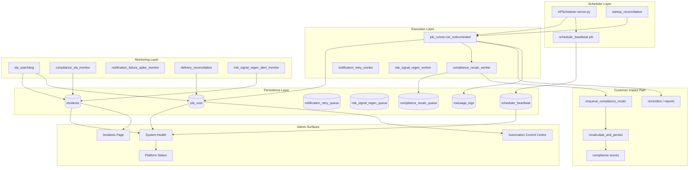

# Operational Dependency Map

**Programme:** OPERATIONAL-RELIABILITY-OBSERVABILITY-INTEGRITY-AUDIT-01



---

## Critical path: compliance score freshness

```
Property mutation / sync
  → compliance_recalc_queue (PENDING)
  → compliance_recalc_worker (15s)
  → recalculate_and_persist
  → automation_status.last_score_recalc_at
  → client dashboard / reports
```

**Failure modes:** stuck RUNNING (reclaim), DEAD rows (SLA monitor), worker down (heartbeat + missed job state).

---

## Critical path: operational truth to UI

```
job_runs (authoritative execution)
  + scheduler_heartbeat (liveness)
  + incidents (open faults)
  → build_health_summary_payload()
  → System Health job_states + overall_health
  → get_control_centre_snapshot()
  → Platform Status scores + alerts
```

**Drift risk:** Jobs scheduled but absent from `job_schedule_registry` → invisible to health/SLA (remediated in this audit).

---

## Notification / alert path

```
Monitor detects fault
  → record_operational_detection (fingerprint dedupe)
  → incidents collection (OPEN)
  → INTERNAL_ALERT email (suppression window)
  → Recovery detected on next successful run
  → incident_recovery auto-resolve
```

**Anti-flood:** fingerprint dedupe, severity suppression windows, flap protection, deploy suppression.

---

## External dependencies

| Dependency | Impact if unavailable |
|---|---|
| MongoDB | All queues, job_runs, incidents halt; API readiness degrades |
| Render web process | Scheduler stops; heartbeat goes stale |
| Postmark | message_logs FAILED; spike monitor may fire |
| Stripe webhooks | Billing reconcile jobs degrade; not compliance timeline |

---

## Registry alignment (post-remediation)

| Set | Count | Must match |
|---|---|---|
| `server.py` scheduled ids | 51 | ✓ |
| `JOB_RUNNERS` | 51 | ✓ |
| `CRITICAL_JOB_REGISTRY` | 51 | ✓ (was 48) |
| `REGISTRY_JOB_OUTCOME_FAMILY` | 51 | ✓ (was 49) |
