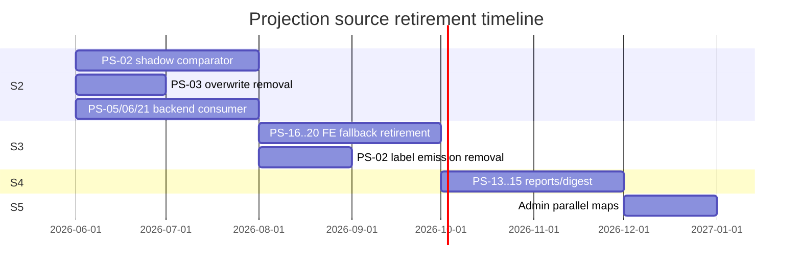

# Retirement roadmap

**Programme:** S2-PROJECTION-SOURCE-DISPOSITION-AUDIT-01  
**Date:** 2026-06-02

---

## Phase overview

---

## By projection source

| ID | Module | Retirement phase | What retires | What survives |
|----|--------|------------------|--------------|---------------|
| PS-01 | client_requirement_lifecycle | — | customer-facing client_lifecycle_label authority | Enum + reason_codes |
| PS-02 | cer_governance_presentation | S3/S4 | derive_truth_presentation label emission | assurance_tier, governance_family, review_owner |
| PS-03 | requirement_truth | — | Lines 804–806 overwrite behaviour | Orchestration hub |
| PS-04 | requirement_satisfaction_service | — | Post-projector label reconciliation | satisfaction_state input |
| PS-05 | cer_actionability_presentation | — | Stage mutation for status | Banner/CTA consumer |
| PS-06 | operational_cognition_service | — | truth_presentation_stage branches | Envelope builder |
| PS-07 | requirement_attention_eligibility | — | Client-facing review_pending mapping | Internal attention codes |
| PS-08 | audience_governance_v1 | S4 | Independent export review aggregates | Landlord interpretation |
| PS-09 | review_assurance_legacy_convergence | S5 (conditional) | If org-review artifacts retired | Convergence input |
| PS-10 | review_queue_service | — | — | Queue membership |
| PS-11 | requirement_evidence_authority | — | — | Authority writer |
| PS-12 | assurance_actionability_service | — | Independent assurance titles | Quick actions hints |
| PS-13 | report_human_language_v1 | **S4** | COMPLIANCE_STATUS_LABELS review maps | Non-status humanization |
| PS-14 | report_layout_governance | **S4** | section_title_for_status review headers | Layout structure |
| PS-15 | monthly_digest_operational_intelligence | **S4** | build_digest_posture_buckets review labels | Digest assembly shell |
| PS-16 | resolvedRequirementViewModel.js | **S3** | projectResolvedRequirementSemantics fallbacks | Non-status view model fields |
| PS-17 | requirementSubmissionModalContext.js | **S3** | buildModalContextHero hard-coded headlines | Modal structure |
| PS-18 | requirementLifecyclePresentation.js | **S3** | Lifecycle-aware CTA rewrites | Non-status presentation |
| PS-19 | evidenceStatus.js | **S3** | evidenceStatusForStatus chip map | Non-status evidence helpers |
| PS-20 | presentationLanguage.js | **S3** | OPERATIONAL_LABEL_BY_KEY retired maps | Filter key constants |
| PS-21 | requirement_action_resolver | — | Pre-projector CTA resolution | take_action envelope |

---

## Extra paths (not in PS-01–21 inventory)

| File | Retirement | Notes |
|------|------------|-------|
| frontend/src/utils/cerGovernancePresentation.js | S3 | FE mirror of PS-02 |
| frontend/src/utils/clientPersistedSubmissionPresentation.js | S3 | Platform verification pending default |
| frontend/src/utils/assurancePresentation.js | S3 | Assurance title override |
| backend/services/progress_contract_service.py | S5 | Admin Review pending label |
| frontend/src/utils/reportHumanLanguage.js | S4 | FE report preview |

---

## API field deprecation timeline

| Field | Shadow (S2) | Active (S2) | S3 | S4+ |
|-------|-------------|-------------|-----|-----|
| customer_status_label | emitted, not consumed by FE | authoritative on API | FE consumes | reports consume |
| customer_status_subline | same | same | same | same |
| truth_presentation_label | emitted (legacy) | mirror/read-only optional | deprecated | removed from client contract |
| client_lifecycle_label | emitted | not customer badge authority | deprecated | internal/admin only |

---

## Retirement gates

| Gate | Criterion |
|------|-----------|
| R-S3 | All PS-16–20 removed or pass-through only; 0 FE fallback divergence on staging |
| R-S4 | Reports/digests use enrich customer_status_* snapshot; 0 retired phrase in export |
| R-S5 | Admin surfaces use projector debug + customer_status_* on explain API |

---

## Long-term survivors (post-S5)

**Backend inputs (A):** PS-01, PS-04, PS-07, PS-09, PS-10, PS-11, PS-21  
**Backend consumers (B):** PS-03, PS-05, PS-06, PS-08, PS-12  
**Governance meta from PS-02:** derive_assurance_tier, governance_family, review_owner, queue_backed_review

**Retired entirely:** derive_truth_presentation customer label path; all PS-13–20 independent status vocabulary; FE fallback layer.
