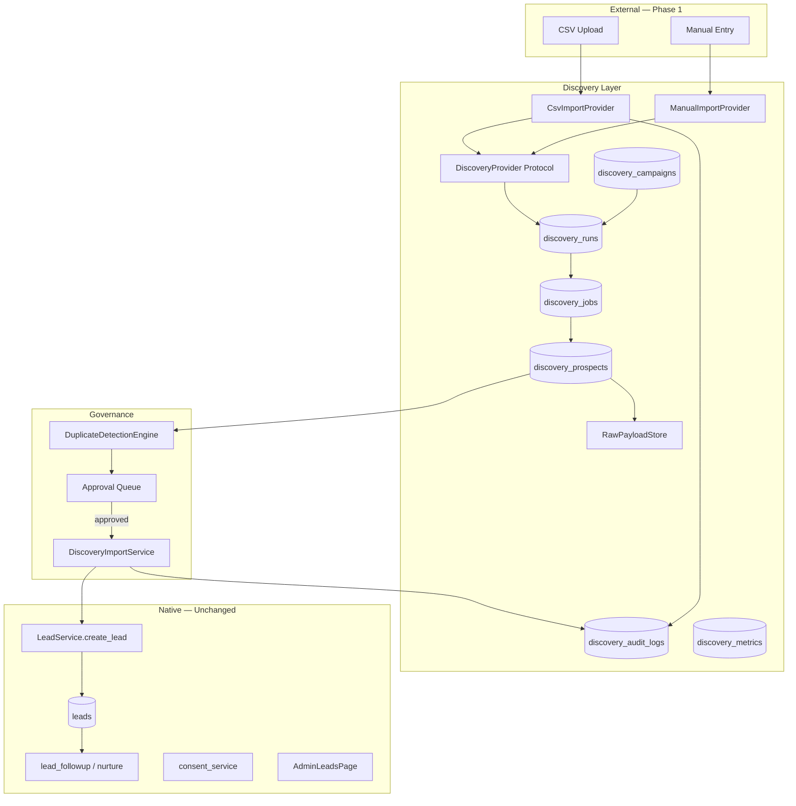

# Discovery Foundation Architecture — Phase 1 Authority

```yaml
---
Status: ACTIVE
Authority Level: TIER_1
Related Docs:
  - docs/adr/ADR_DISCOVERY_PROVIDER_NEUTRAL_ARCHITECTURE.md
  - docs/adr/ADR_DISCOVERY_RETENTION_AND_ERASURE.md
  - docs/contracts/DISCOVERY_PROVIDER_PROTOCOL.md
  - docs/contracts/DISCOVERY_SOURCE_METADATA_V1.json
  - docs/trackers/DISCOVERY_PHASE_1_IMPLEMENTATION_TRACKER.md
  - docs/launch/DISCOVERY_PHASE_1_LAUNCH_GATE.md
  - docs/governance/DISCOVERY_HASH_AND_IDEMPOTENCY_GOVERNANCE_REVIEW_01.md
  - docs/governance/DISCOVERY_APPROVAL_IMPORT_GOVERNANCE_FREEZE_01.md
Source Audits:
  - PROSPECT-DISCOVERY-STRATEGY-AND-PROVIDER-ARCHITECTURE-AUDIT-01
  - DISCOVERY-FOUNDATION-IMPLEMENTATION-PLAN-01
  - DISCOVERY-FOUNDATION-ARCHITECTURE-HARDENING-REVIEW-01
  - DISCOVERY-HASH-AND-IDEMPOTENCY-GOVERNANCE-REVIEW-01
Supersedes: informal discovery planning only
Superseded By: —
Last Governance Review: 2026-06-18
Implementation Scope: Phase 1 — develop/staging only; CSV/manual provider
Runtime Authority Areas: discovery ingest, approval queue, import to CRM
---
```

## 1. Purpose

This document is the **canonical behavioural authority** for Phase 1 Prospect Discovery Foundations. Discovery is a **pre-CRM layer**. The platform database remains the source of truth. No external provider may write directly to CRM, nurture, compliance, evidence, or billing systems.

**Approved:** Provider-neutral foundation, CSV-first provider, approval queue, `DiscoveryImportService` → `LeadService.create_lead` only.

**Not approved (Phase 1):** Twin, Apollo, Clay, internal crawler, autonomous outreach, production enablement before staging launch gate.

---

## 2. Architectural principles

| Principle | Requirement |
|-----------|-------------|
| Provider-neutral | All providers implement `DiscoveryProvider` protocol; no provider-specific CRM logic |
| Pre-CRM only | `discovery_prospects` is not `leads`; prospects become leads only after approval + import |
| LeadService sole import authority | `DiscoveryImportService` must call `LeadService.create_lead`; no direct `leads` inserts |
| Native CRM source of truth | `leads` collection and existing nurture/scoring/conversion paths unchanged |
| Approval gate | Every candidate passes human review (or explicit bulk approve with audit) before import |
| No provider outreach | Providers may suggest candidates; platform owns all outreach via existing nurture |
| No provider compliance access | Providers cannot read/write evidence, documents, or compliance state |
| Anti-lock-in | Canonical prospect schema + `origin_lineage` + versioned `source_metadata.discovery` |
| Consent default | `marketing_consent = false` unless explicit consent with lawful basis |
| Feature-flagged | All discovery capabilities disabled in production until launch gate GO |

---

## 3. System context



---

## 4. Layer responsibilities

### 4.1 Discovery Provider Layer

- **Contract:** `docs/contracts/DISCOVERY_PROVIDER_PROTOCOL.md`
- **Phase 1 active providers:** `csv`, `manual` only
- **Responsibilities:** validate, map to canonical schema, produce idempotency key, create prospects via prospect service
- **Prohibited:** CRM writes, outreach, notification sends, compliance/evidence access

### 4.2 Discovery Campaign Layer

- **Collection:** `discovery_campaigns`
- **Purpose:** Strategic sourcing context (ICP, owner, lawful basis declaration, budget reference)
- **Not the same as:** `pilot_redeemed_campaign_snapshots` (conversion-side); link post-conversion only

### 4.3 Discovery Run Layer

- **Collection:** `discovery_runs`
- **Purpose:** Operational batch (one CSV upload, one manual batch)
- **Required:** `campaign_id` (nullable for ad-hoc), admin attestation, cost fields (nullable/zero for CSV)

### 4.4 Discovery Job Layer

- **Collection:** `discovery_jobs`
- **Phase 1:** Stub — CSV creates single `completed` job synchronously
- **Phase 2:** Async jobs for API providers and crawlers

### 4.5 Discovery Prospect Store

- **Collection:** `discovery_prospects`
- **Lifecycle:** `discovered` → `needs_review` → (`duplicate_detected` | `approved` | `rejected`) → `imported` | `archived`
- **Must Fix fields:** `content_hash`, `platform_quality_score`, `provider_confidence`, `origin_lineage[]`, `email_hash`, `phone_hash`, `merged_into_prospect_id`, `tenant_id` (reserved, default `pleerity`)

### 4.6 Duplicate Detection Engine

- **Authoritative hierarchy:** See §13 Discovery Dedupe Hierarchy
- Global cross-run dedupe on `email_hash` / `phone_hash` (primary signals)
- CRM match via `LeadService.find_duplicate`
- Classifications: `none`, `possible`, `confirmed`
- Reviewer override with audit reason code
- **`content_hash` is not the primary cross-run identity signal** — it is an ingest-scoped fingerprint (§12)

### 4.7 Approval Queue

- All prospects require review before import (bulk approve allowed with per-row audit)
- Status machine enforced in `discovery_prospect_service`
- No auto-import without `DISCOVERY_AUTO_IMPORT_ON_APPROVE` flag and approval audit
- **Approval creates import eligibility only** — never creates leads
- `request_changes`: returns prospect to `needs_review`; requires `change_request_notes`; emits `PROSPECT_REVIEWED`; does not change duplicate classification or import eligibility (see `DISCOVERY_APPROVAL_IMPORT_GOVERNANCE_FREEZE_01.md` §3)
- Reviewer actions requiring attribution: approve, reject, request_changes, mark_duplicate, clear_duplicate, archive (§4)

### 4.8 Discovery Import Service

- Sole path from approved prospect to lead
- Validates governance: lawful basis, consent rules, duplicate gate, eligibility checklist (§6 of governance freeze)
- **Import workflow audit chain:** `IMPORT_REQUESTED` → `IMPORT_VALIDATED` → `LeadService.create_lead()` → `PROSPECT_IMPORTED`; failure before CRM: `IMPORT_BLOCKED`
- Writes versioned `source_metadata.discovery` per `DISCOVERY_SOURCE_METADATA_V1.json`
- Creates `discovery_audit_logs` and metrics increments

### 4.9 Audit Layer

- **Collection:** `discovery_audit_logs` — append-only, immutable
- Frozen event taxonomy including approval/import sub-workflow events (see tracker Stage L; governance freeze §2)
- Phase 1 approval/import events: `PROSPECT_REVIEWED`, `IMPORT_REQUESTED`, `IMPORT_VALIDATED`, `IMPORT_BLOCKED` (frozen — code sync Stages N/P)

### 4.10 Payload Storage

- **Abstraction:** `RawPayloadStore` interface
- **Rule:** No uncontrolled inline raw payloads on main prospect document
- **Reference:** `raw_payload_reference` only on `discovery_prospects`
- Phase 1: local/object-store adapter behind interface

### 4.11 Metrics Layer

- **Collection:** `discovery_metrics` (daily rollups)
- Campaign-level funnel, cost attribution fields reserved
- Conversion attribution via `client_id` lookup and `source_metadata.discovery`

---

## 5. Future provider support model

| Provider | Phase | Integration model |
|----------|-------|-------------------|
| CSV | 1 | Sync upload via `CsvImportProvider` |
| Manual | 1 | Admin form via `ManualImportProvider` |
| Apollo | 2 | Async `DiscoveryJob` + API adapter; US transfer basis required |
| Clay | 2 | Async job + table mapping profile |
| Twin | 2+ | **Orchestration only** — export webhook → discovery ingest; not a data authority |
| Internal crawler | 2+ | Async job + crawl session model + robots compliance |

**Replacement model:** Disable provider flag → stop ingest → existing prospects/leads retain `origin_lineage` and versioned metadata → no CRM migration required.

---

## 6. Lead integration

### Import mapping

```
LeadCreateRequest:
  source_platform: IMPORT  # reuse existing enum
  marketing_consent: prospect.marketing_consent  # default false
  source_metadata.discovery: <DISCOVERY_SOURCE_METADATA_V1>
  tags: ["discovery_import_v1", "discovery_run:{run_id}", ...]
```

### Prohibited

- `LeadService` bypass (direct `db.leads.insert`)
- Provider calling `convert_lead`, nurture triggers, or `notification_orchestrator`
- Setting `marketing_consent=true` without `lawful_basis=consent` and evidence

### Legacy path

`POST /api/admin/leads/import/csv` **must be deprecated** (410 or redirect) before Phase 1 staging validation. Single import path: `/api/admin/discovery/runs/csv`.

---

## 7. Single-tenant invariant

Phase 1 discovery operates under **single platform tenant** (`tenant_id = "pleerity"`). The `tenant_id` field is reserved on all discovery collections for future multi-tenant SaaS without migration. Cross-tenant duplicate leakage is forbidden.

---

## 8. Code module layout (planned)

```text
backend/services/discovery/
  discovery_models.py
  discovery_campaign_service.py
  discovery_run_service.py
  discovery_job_service.py
  discovery_prospect_service.py
  discovery_audit_service.py
  discovery_duplicate_service.py
  discovery_import_service.py
  discovery_metrics_service.py
  discovery_quality_service.py
  raw_payload_store.py
  providers/
    discovery_provider_protocol.py
    csv_import_provider.py
    manual_import_provider.py
backend/routes/admin_discovery.py
frontend/src/pages/admin/discovery/*
frontend/src/api/discoveryApi.js
```

---

## 9. Hardening review — Must Fix binding items

| # | Item | Authority location |
|---|------|-------------------|
| 1 | `DiscoveryProvider` protocol + idempotency + canonical mapping | `DISCOVERY_PROVIDER_PROTOCOL.md` |
| 2 | `discovery_campaigns` + `campaign_id` on runs | This doc §4.2; Campaign governance |
| 3 | Global cross-run dedupe | This doc §4.6; prospect schema |
| 4 | Versioned `source_metadata.discovery` | `DISCOVERY_SOURCE_METADATA_V1.json` |
| 5 | Payload storage abstraction | This doc §4.10 |
| 6 | Retention + erasure + lead cascade | `ADR_DISCOVERY_RETENTION_AND_ERASURE.md` |
| 7 | Legacy CSV import deprecation | This doc §6; Tracker Stage U |
| 8 | `platform_quality_score` ≠ `provider_confidence` | prospect schema; quality service |
| 9 | `content_hash` + provider_reference uniqueness | prospect schema; indexes; §12 Hash Semantics |
| 10 | Admin attestation on CSV run | `discovery_runs`; Compliance doc |
| 11 | Single-tenant / `tenant_id` reserved | This doc §7 |
| 12 | Frozen audit event taxonomy | Tracker Stage L; audit service |

---

## 10. Governance cross-reference

| Concern | Document |
|---------|----------|
| ADR — provider neutrality | `docs/adr/ADR_DISCOVERY_PROVIDER_NEUTRAL_ARCHITECTURE.md` |
| ADR — retention/erasure | `docs/adr/ADR_DISCOVERY_RETENTION_AND_ERASURE.md` |
| Anti-lock-in | `docs/governance/DISCOVERY_ANTI_LOCK_IN_CHECKLIST.md` |
| Compliance | `docs/governance/DISCOVERY_COMPLIANCE_AND_CONSENT.md` |
| Campaign/ROI | `docs/governance/DISCOVERY_CAMPAIGN_AND_ROI_GOVERNANCE.md` |
| Feature flags | `docs/governance/DISCOVERY_FEATURE_FLAGS.md` |
| Launch gate | `docs/launch/DISCOVERY_PHASE_1_LAUNCH_GATE.md` |
| Implementation tracker | `docs/trackers/DISCOVERY_PHASE_1_IMPLEMENTATION_TRACKER.md` |
| Hash / idempotency governance | `docs/governance/DISCOVERY_HASH_AND_IDEMPOTENCY_GOVERNANCE_REVIEW_01.md` |
| Approval / import / CRM protection | `docs/governance/DISCOVERY_APPROVAL_IMPORT_GOVERNANCE_FREEZE_01.md` |

---

## 12. Hash Semantics and Governance

### 12.1 Definition — Canonical Ingest Fingerprint

`content_hash` is a **Canonical Ingest Fingerprint**.

It identifies a **specific discovered prospect record within a specific ingest context** using canonicalised discovery content.

`content_hash` is **not**:

- A global person identity key
- The primary cross-run dedupe signal
- A substitute for `email_hash` or `phone_hash`

**Code authority:** `backend/services/discovery/discovery_hashing.py` — `compute_canonical_content_hash()`

### 12.2 Version 1 specification (frozen governance)

| Property | V1 value |
|----------|----------|
| `content_hash_version` | `"1"` (governance field — see §12.3) |
| `hash_algorithm` | `"sha256"` |
| Algorithm | SHA-256 over UTF-8 payload |
| Separator | Unit separator `\x1f` between field segments |
| Output | 64-character lowercase hex string |

### 12.3 Hash version governance

| Field | Purpose | V1 value |
|-------|---------|----------|
| `content_hash_version` | Canonical field set + normalisation rules generation | `"1"` |
| `hash_algorithm` | Digest algorithm identifier | `"sha256"` |

**Ownership:** Platform engineering — defined in `discovery_hashing.py`; providers consume, never define.

**Version bump rules:**

- Increment `content_hash_version` when canonical field order, included/excluded fields, separator, or normalisation rules change
- Increment `hash_algorithm` only when digest algorithm changes (e.g. SHA-256 → future algorithm)
- Each bump requires ADR amendment and tracker migration note

**Compatibility expectations:**

- Hashes are comparable **only within the same** `content_hash_version` and `hash_algorithm`
- Records without version fields are treated as V1 / SHA-256 for pre-versioning data
- Dedupe and idempotency must not equate hashes across versions

**Migration expectations (future):**

- Existing records retain original hash + version at create time
- Optional background rehash audit job (Phase 2+) — not Phase 1
- Lineage entries record the version active at ingest time

**Phase 1 note:** Version fields are **documented only** in this governance update. Persistence on `discovery_prospects` and import metadata is scheduled with Stage K/P implementation — no database migration in this update.

### 12.4 Included fields (canonical order — do not reorder without version bump)

Fixed order in `CANONICAL_HASH_FIELD_ORDER`:

1. `provider`
2. `provider_reference`
3. `source_url`
4. `company_name`
5. `contact_name`
6. `email`
7. `phone`
8. `website`
9. `location`
10. `business_type`
11. `landlord_type`
12. `campaign_id`
13. `discovery_run_id`

### 12.5 Excluded fields (volatile / operational — never hashed)

Including but not limited to: `created_at`, `updated_at`, `review_status`, reviewer fields, `provider_confidence`, `platform_quality_score`, `raw_payload_reference`, audit fields, duplicate/import fields, erasure fields, `email_hash`, `phone_hash`, `tenant_id`, `origin_lineage`, `source_type`, `discovery_job_id`, `prospect_id`, `risk_flags`, `legal_hold`, `marketing_consent`, `lawful_basis`.

Provider-specific enrichment in `provider_extensions` is excluded.

### 12.6 Normalisation rules (V1)

| Field | Rule |
|-------|------|
| `email` | Trim; lowercase |
| `phone` | Digits only (non-digit characters stripped) |
| `location` | Dict → `city\|region\|postcode\|country` (each part trim + lowercase); scalar → trim + lowercase |
| `provider`, `business_type`, `landlord_type` | Trim + lowercase |
| All other included fields | Trim + lowercase string representation |
| Missing / null | Empty string segment |

**Known V1 limitations (documented; defer normalisation changes to V2):** international phone equivalence (`+44` vs `07…`), URL canonicalisation (`www`, trailing slash).

### 12.7 Ownership

| Concern | Owner |
|---------|-------|
| Canonical field order | Platform (`discovery_hashing.py`) |
| Normalisation rules | Platform (`discovery_hashing.py`) |
| Version registry | Architecture + ADR amendment |
| Provider mapping to canonical fields | Provider adapter (`map_to_canonical`) |

---

## 13. Discovery Dedupe Hierarchy

**Authority for Stage K `DuplicateDetectionEngine` implementation.**

`content_hash` must **not** be treated as the primary cross-run identity signal.

### 13.1 Authoritative priority order

| Priority | Signal | Scope |
|----------|--------|-------|
| **1** | `email_hash` | Tenant-scoped cross-run |
| **2** | `phone_hash` | Tenant-scoped cross-run |
| **3** | CRM duplicate detection | `LeadService.find_duplicate` |
| **4** | `content_hash` + `discovery_run_id` | Within-run retry / same-ingest idempotency |
| **5** | `provider` + `provider_reference` + `discovery_run_id` | Exact row re-upload (unique index) |
| **6** | `merged_into_prospect_id` | Merge chain resolution |

### 13.2 Classification rules

| Status | Criteria |
|--------|----------|
| `confirmed` | `email_hash` or `phone_hash` match on non-erased prospect; or CRM duplicate confirmed |
| `possible` | Fuzzy company+website match; partial phone; same-domain email alias; weak identity overlap |
| `none` | No match above thresholds |

### 13.3 Fallback rules

- **Hash version differs:** Compare `email_hash` / `phone_hash` only; do not equate `content_hash` across `content_hash_version` values
- **Provider normalisation differs:** Dedupe on platform-normalised `email_hash` / `phone_hash`, not raw `provider_reference`
- **Prospect updated after create:** Use stored `email_hash` / `phone_hash` at evaluation time; `content_hash` on document is immutable at create
- **Erasure suppression:** Active erasure blocks re-ingest via suppression hashes; `content_hash` match alone is insufficient

### 13.4 Cross-provider behaviour

When the same person is discovered via different providers (e.g. CSV → Apollo):

- `content_hash` will differ (includes `provider`, `provider_reference`, `discovery_run_id`)
- `email_hash` / `phone_hash` should match → `confirmed` duplicate
- `origin_lineage` appends new entry; prior entries remain immutable

---

## 14. Canonical Identity Snapshot (governance reservation)

**Not implemented in Phase 1.** Reserved for future stage.

### 14.1 Purpose

`canonical_identity_snapshot` preserves the **normalised canonical field values** used to compute `content_hash` at create time.

Use cases: audit reconstruction, dedupe investigations, provenance reviews, provider disputes, hash regeneration on version migration.

### 14.2 Intended contents (V1 reservation)

Normalised values only for fields in `CANONICAL_HASH_FIELD_ORDER` — no raw provider payload.

### 14.3 Retention and erasure

| Phase | Behaviour |
|-------|-----------|
| Create | Immutable snapshot at prospect create; copied to import metadata on import |
| Erasure | Anonymise snapshot PII with prospect erasure; retain hash + version + provider refs per ADR stub rules |
| Post-import | Retain on `source_metadata.discovery` (minimised) |

**Implementation stage:** Recommended before import stage (Tracker Stage P) or Phase 2 — governance only in this update.

---

## 16. Discovery CRM protection rules

**Authority:** `docs/governance/DISCOVERY_APPROVAL_IMPORT_GOVERNANCE_FREEZE_01.md` §7. Launch-gate critical.

| Path | Verdict |
|------|---------|
| Provider → CRM | **PROHIBITED** |
| Provider → `LeadService` | **PROHIBITED** |
| Approval Queue → CRM | **PROHIBITED** |
| Approval Queue → `LeadService` | **PROHIBITED** |
| Review Workflow → CRM | **PROHIBITED** |
| Discovery routes → `LeadService` | **PROHIBITED** (except Import Service delegation) |
| `DiscoveryImportService` → `LeadService.create_lead` | **ONLY PERMITTED PATH** |

Mandatory provider chain (all providers, all phases):

```text
Provider → Prospect → Review → Import → LeadService
```

No bypass paths. Twin/Apollo/Clay/crawler adapters must conform to the same chain.

---

## 17. Change control

- TIER_1 changes require product + platform sign-off
- No production flag enablement without `DISCOVERY_PHASE_1_LAUNCH_GATE.md` GO
- Phase 2 provider work requires new ADR amendment, not silent scope expansion
