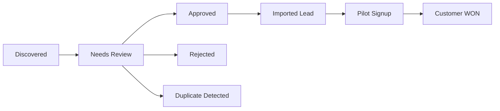

# Discovery Campaign and ROI Governance

```yaml
---
Status: ACTIVE
Authority Level: TIER_1
Related:
  - docs/DISCOVERY_FOUNDATION_ARCHITECTURE.md
  - docs/governance/DISCOVERY_COMPLIANCE_AND_CONSENT.md
Last Review: 2026-06-02
---

```

## 1. Purpose

`discovery_campaigns` provides **strategic sourcing context** distinct from operational `discovery_runs`. Enables ROI reporting, compliance evidence, and provider comparison without vendor lock-in.

**Not the same as:** `pilot_redeemed_campaign_snapshots` (conversion-side). Link via `client_id` / `pilot_redeemed_campaign_snapshot_id` post-conversion only.

---

## 2. discovery_campaigns model

| Field | Type | Required | Description |
|-------|------|----------|-------------|
| `campaign_id` | string | Y | `DCAMP-{ts}-{hex6}` |
| `name` | string | Y | Human label |
| `purpose` | string | Y | Business objective |
| `target_icp` | object | Y | `{business_types[], regions[], portfolio_min, portfolio_max, notes}` |
| `owner_id` | string | Y | Admin portal user |
| `owner_email` | string | Y | Denormalised |
| `lawful_basis` | enum | Y | Default for runs |
| `lia_reference_id` | string | C | Required if `legitimate_interest_b2b` |
| `budget_reference` | string | N | Finance tracking code |
| `budget_amount` | decimal | N | Optional cap |
| `budget_currency` | string | N | Default `GBP` |
| `status` | enum | Y | `draft`, `active`, `paused`, `completed`, `archived` |
| `tenant_id` | string | Y | Default `pleerity` |
| `created_at` | datetime | Y | |
| `updated_at` | datetime | Y | |

---

## 3. Cost attribution

### On discovery_runs

| Field | Phase 1 default |
|-------|-----------------|
| `estimated_cost` | `0` |
| `cost_currency` | `GBP` |
| `cost_units` | `0` |
| `cost_unit_type` | `rows` / `credits` / `minutes` |
| `provider_billing_ref` | null |

### On discovery_prospects (optional)

- `allocated_cost` — run cost / accepted rows

### Metrics (daily rollups per campaign + provider)

- `cost_per_discovered`
- `cost_per_approved`
- `cost_per_imported_lead`
- `cost_per_pilot_signup`
- `cost_per_customer`

---

## 4. Provider comparison

Dashboard dimensions:

| Dimension | Source |
|-----------|--------|
| Volume | `discovered`, `imported` by provider |
| Quality | avg `platform_quality_score`, `provider_confidence` |
| Duplicate rate | `duplicate_confirmed / discovered` |
| Approval rate | `approved / needs_review` |
| Conversion | imported → lead → pilot → customer |
| Cost efficiency | cost metrics above |

Phase 1: CSV only — establishes baseline for Phase 2 vendor selection.

---

## 5. Provider quality score

Composite (deterministic Phase 1):

```
provider_quality_score = weighted_mean(
  platform_quality_score,
  1 - duplicate_rate,
  approval_rate,
  import_success_rate
)
```

Stored in `discovery_metrics` per provider per campaign per day.

---

## 6. Campaign-level funnel reporting



**Attribution rules:**

| Stage | Attribution |
|-------|-------------|
| Imported lead | `imported_lead_id` on prospect |
| Pilot signup | `client.pilot_redeemed_campaign_snapshot_id` + lead `client_id` join |
| Customer | lead `stage=WON` or `status=CONVERTED` |

**Not tag-only:** tags (`discovery_import_v1`) are supplementary; joins are authoritative.

---

## 7. Reviewer SLA metrics (reserved)

| Metric | Field |
|--------|-------|
| Time in queue | `first_review_at - created_at` |
| Time to decision | `review_timestamp - created_at` |
| Reviewer throughput | actions per reviewer per day |

Stored in `discovery_metrics` and prospect timestamps.

---

## 8. Reporting integration

- Emit `product_analytics_service` event on import: `discovery_prospect_imported`
- Include `campaign_id`, `provider`, `platform_quality_score` snapshot in metadata
- Admin Metrics Dashboard reads `discovery_metrics` API

---

## 9. Governance rules

- Runs without `campaign_id` allowed for ad-hoc tests only (staging); production pilot requires campaign
- Campaign `status=archived` blocks new runs
- Budget cap (Phase 2): block run if `estimated_cost` exceeds remaining budget
